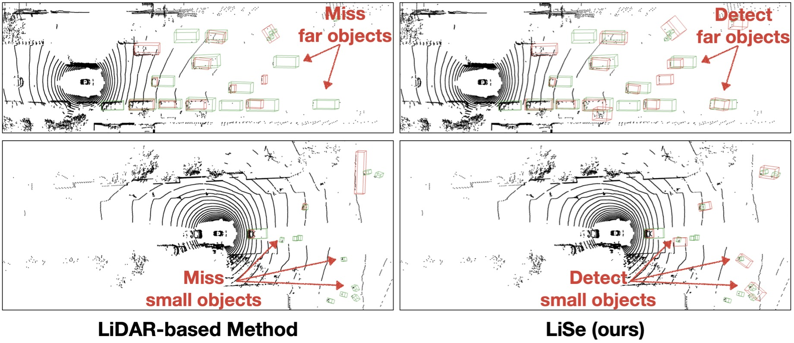

# Approaching Outside: Scaling Unsupervised 3D Object Detection from 2D Scene (ECCV'24)

by Ruiyang Zhang, Hu Zhang, Hang Yu, [Zhedong Zheng](https://www.zdzheng.xyz/)

## Motivation


## Abstract
The unsupervised 3D object detection is to accurately detect objects in unstructured environments with no explicit supervisory signals.
This task, given sparse LiDAR point clouds, often results in compromised performance for detecting small or distant objects due to the inherent sparsity and limited spatial resolution. In this paper, we are among the early attempts to integrate LiDAR data with 2D images for unsupervised 3D detection and introduce a new method, dubbed LiDAR-2D Self-paced Learning (LiSe). We argue that RGB images serve as a valuable complement to LiDAR data, offering precise 2D localization cues, particularly when scarce LiDAR points are available for certain objects. Considering the unique characteristics of both modalities, our framework devises a self-paced learning pipeline that incorporates adaptive sampling and weak model aggregation strategies. The adaptive sampling strategy dynamically tunes the distribution of pseudo labels during training, countering the tendency of models to overfit on easily detected samples, such as nearby and large-sized objects. By doing so, it ensures a balanced learning trajectory across varying object scales and distances. The weak model aggregation component consolidates the strengths of models trained under different pseudo label distributions, culminating in a robust and powerful final model. Experimental evaluations validate the efficacy of our proposed LiSe method, manifesting significant improvements of +7.1% AP<sub>BEV</sub> and +3.4% AP<sub>3D</sub> on nuScenes, and +8.3% AP<sub>BEV</sub> and +7.4% AP<sub>3D</sub> on Lyft compared to existing techniques.

## Environment
- for MODEST, follow [`MODEST/README.md`](MODEST/README.md) to install.
- for GroundingDINO, follow [`GroundingDINO/README.md`](GroundingDINO/README.md) to install.
- for FGR, follow [`FGR/README.md`](FGR/README.md) to install.

## Integration with 2D scenes
```
<!-- Identify discriminative objects within the images -->
conda activate GroundingDINO; cd LiSe/GroundingDINO; ln -s PATH_TO_YOUR_DATASET_DIR data; mkdir lyft_2Dbox_img; mkdir lyft_2Dbox_txt; mkdir lyft_2Dbox_pkl; python gd_inference.py;

<!-- Lifting process from 2D to 3D, obtain image-based pseudo 3D boxes -->
conda activate FGR; cd LiSe/FGR/FGR; python save_region_grow_result.py --kitti_dataset_path ../data/lyft --output_dir ../lyft_output --root_dir ../split/lyft_train.txt --dataset lyft; python detect.py --kitti_dataset_path ../data/lyft --final_save_path ../lyft_output_detect --pickle_save_path ../lyft_output --save_det_image --train_split_path ../split/lyft_train.txt --not_merge_valid_labels;

<!-- Integration with 2D scenes, distance-aware fusion -->
conda activate MODEST; cd LiSe/MODEST; python integration_with_2D_scenes.py --B_LiDAR_dir_path LiSe/MODEST/generate_cluster_mask/intermediate_results/lyft_original_seed/lyft_labels_pp_score_fw70_2m_r0.3_fov/\*  --B_img_dir_path LiSe/FGR/lyft_output_detect/labels/ --B_final_dir_path LiSe/MODEST/generate_cluster_mask/intermediate_results/lyft_labels_pp_score_fw70_2m_r0.3_fov/ --d_min 10;
```
We upload final generated pseudo labels at [`MODEST/storage`](MODEST/storage). They can be directly used for training.

## Pseudo Labels-based Self-paced Learning
### Lyft (default PRCNN model)
```bash
conda activate MODEST; cd LiSe/MODEST; bash scripts/seed_training_lyft.sh; bash scripts/self_training_lyft.sh -C "det_filtering.pp_score_threshold=0.7 det_filtering.pp_score_percentile=20 data_paths.bbox_info_save_dst=null data_root=$(pwd)/downstream/OpenPCDet/data/lyft/training";
```
### nuScenes (default PRCNN model)
```bash
conda activate MODEST; cd LiSe/MODEST; bash scripts/seed_training_nuscenes.sh; bash scripts/self_training_nusc.sh -C "data_paths=nusc.yaml det_filtering.pp_score_threshold=0.7 det_filtering.pp_score_percentile=20 data_paths.bbox_info_save_dst=null calib_path=$(pwd)/downstream/OpenPCDet/data/nuscenes_boston/training/calib ptc_path=$(pwd)/downstream/OpenPCDet/data/nuscenes_boston/training/velodyne image_shape=[900,1600]"
```

## Evaluation
### Lyft (default PRCNN model)
```bash
conda activate MODEST; cd LiSe/MODEST/downstream/OpenPCDet/tools; bash scripts/dist_test.sh 4 --cfg_file ../../downstream/OpenPCDet/tools/cfgs/lyft_models/pointrcnn_dynamic_obj.yaml --ckpt PATH_TO_CKPT
```
### nuScenes (default PRCNN model)
```bash
conda activate MODEST; cd LiSe/MODEST/downstream/OpenPCDet/tools; bash scripts/dist_test.sh 4 --cfg_file ../../downstream/OpenPCDet/tools/cfgs/nuscenes_boston_models/pointrcnn_dynamic_obj.yaml --ckpt PATH_TO_CKPT
```

## Checkpoints
### Lyft experiments
| Model | ST rounds | Checkpoint  | Config file |
| ----- | :----:  | :----: | :----: |
| PointRCNN | 0 | [link](https://drive.google.com/file/d/12LX-wStgAtykKEnFKh336TWrMsabdBtR/view?usp=sharing) | [cfg](downstream/OpenPCDet/tools/cfgs/lyft_models/pointrcnn_dynamic_obj.yaml) |
| PointRCNN | 1 | [link](https://drive.google.com/file/d/1Q7vTQ5Pcp1S4BeGyX3blyaT4wjVjia5t/view?usp=sharing) | [cfg](downstream/OpenPCDet/tools/cfgs/lyft_models/pointrcnn_dynamic_obj.yaml) |
| PointRCNN | 10 | [link](https://drive.google.com/file/d/1ZLQuusvZW7COR42GhWuqIPpUEmxZhTWr/view?usp=sharing) | [cfg](downstream/OpenPCDet/tools/cfgs/lyft_models/pointrcnn_dynamic_obj.yaml) |

### nuScenes experiments
| Model | ST rounds | Checkpoint  | Config file |
| ----- | :----:  | :----: | :----: |
| PointRCNN | 0 | [link](https://drive.google.com/file/d/19zFD28-GcfsBEq39Febn71fw7hfb4wqB/view?usp=sharing) | [cfg](downstream/OpenPCDet/tools/cfgs/nuscenes_boston_models/pointrcnn_dynamic_obj.yaml) |
| PointRCNN | 1 | [link](https://drive.google.com/file/d/1f2zXTH3wSfz33MxkSZpCjtAZtwX5NyWo/view?usp=sharing) | [cfg](downstream/OpenPCDet/tools/cfgs/nuscenes_boston_models/pointrcnn_dynamic_obj.yaml) |
| PointRCNN | 10 | [link](https://drive.google.com/file/d/13denuUq0cYULF_pfidCE0vchLyZMJbZL/view?usp=sharing) | [cfg](downstream/OpenPCDet/tools/cfgs/nuscenes_boston_models/pointrcnn_dynamic_obj.yaml) |

## Core codes
- [`GroundingDINO/gd_inference.py`](GroundingDINO/gd_inference.py): GroundingDINO inference on image set of autonomous driving dataset.
- [`FGR/FGR/save_region_grow_result.py`](FGR/FGR/save_region_grow_result.py), [`FGR/FGR/detect.py`](FGR/FGR/detect.py): Lift GroundingDINO 2D boxes to 3D boxes.
- [`MODEST/integration_with_2D_scenes.py`](MODEST/integration_with_2D_scenes.py): Intergrate LiDAR-based pseudo boxes and image-based pseudo boxes.

## License
This project is under the MIT License.

## Contact
Please open an issue if you have any questions about using this repo.

## Acknowledgement
Our repo is based on [MODEST(CVPR'22)](https://github.com/YurongYou/MODEST), [GroundingDINO(ECCV'24)](https://github.com/IDEA-Research/GroundingDINO), [FGR(ICRA'21)](https://github.com/weiyithu/FGR), [OpenPCDet](https://github.com/open-mmlab/OpenPCDet). Thanks for their great works and open-source effort!

## Citation
```bib
@inproceedings{zhang2024approaching,
  title={Approaching Outside: Scaling Unsupervised 3D Object Detection from 2D Scene},
  author={Zhang, Ruiyang and Zhang, Hu and Yu, Hang and Zheng, Zhedong},
  booktitle={Proceedings of the European conference on computer vision (ECCV)},
  year={2024}
}
```
